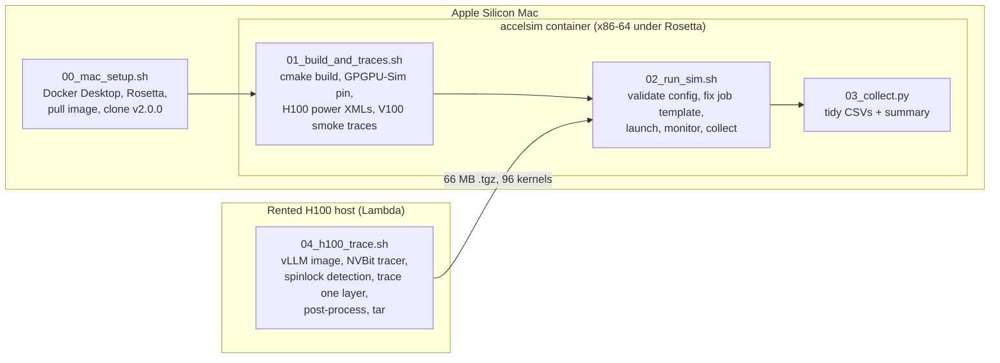

<h1 align="center">LLM performance &amp; power on a simulated H100</h1>

<p align="center">
Cycle-level simulation of real Hopper LLM kernels with <a href="https://github.com/accel-sim/accel-sim-framework">Accel-Sim 2.0</a> and the AccelWattch power model,<br>
run end to end on an Apple Silicon Mac, with two short H100 rentals for tracing.
</p>

<p align="center">


<a href="LICENSE"></a>
</p>

---

## TL;DR

- **A reproducible pipeline** (six scripts) that builds Accel-Sim 2.0 in a container on a Mac, replays published traces, traces one transformer layer of a real LLM on a rented H100, and replays it on the H100 model with power. Every upstream problem hit along the way is worked around in the scripts and documented below.
- **Validated on published Tesla V100 traces**: 10 benchmarks, all clean, cycle counts identical with and without the power model; the H100 model replays the same traces in **1.07× to 1.43×** fewer cycles.
- **A real H100 trace of a decoder layer** of Qwen2.5-0.5B under vLLM: 96 kernels, one prefill pass plus 7 decode passes of 12 kernels each. **All 96 simulate to completion** on the H100 model with power: **645,976 cycles, 263.9 M instructions, 81.6 W** average. A decode pass costs **79.5k cycles**, only 11% less than the 11-token prefill pass (89.5k): at this size the block is bound by per-kernel launch overhead, not by compute.
- **A sensitivity sweep of the H100 model** on that layer, one parameter at a time: removing the model's fixed 3,000-cycle **kernel launch latency cuts the block's time by 42%**, while halving or doubling any memory latency moves it by −2% to +11%. At this model size the GPU's memory hierarchy barely matters; the number of kernels launched does.
- **An upstream bug found, reported and fixed**: the first replay deadlocked on kernel 11, a cuBLAS **split-K GEMM** (`nvjet_sm90_*_splitK`). Reported as [accel-sim/accel-sim-framework#561](https://github.com/accel-sim/accel-sim-framework/issues/561); the maintainers traced it to the **trace post-processor wrongly deleting `TRYWAIT` instructions** and supplied a patch, which this repo carries in [`patches/`](patches/) and `04_h100_trace.sh -P` applies. See [the section below](#the-split-k-deadlock-accel-sim-issue-561).

> [!NOTE]
> All watts in this repository come from AccelWattch's **V100-calibrated** coefficients (the only ones upstream ships; SM count and clock are injected at runtime). They are a **relative** power model, good for kernel-vs-kernel and config-vs-config comparison, not absolute H100 watts. Details in [Power model caveat](#power-model-caveat).

---

## Contents

- [Background](#background)
- [Pipeline](#pipeline)
- [Repository layout](#repository-layout)
- [Reproduce it](#reproduce-it)
- [Results](#results)
  - [1. Toolchain validation on published V100 traces](#1-toolchain-validation-on-published-v100-traces)
  - [2. H100 model vs V100 model on the same traces](#2-h100-model-vs-v100-model-on-the-same-traces)
  - [3. A real LLM layer on the H100 model](#3-a-real-llm-layer-on-the-h100-model)
  - [4. Which hardware parameter does the block care about?](#4-which-hardware-parameter-does-the-block-care-about)
- [The split-K deadlock (Accel-Sim issue #561)](#the-split-k-deadlock-accel-sim-issue-561)
- [Power model caveat](#power-model-caveat)
- [Upstream problems the scripts work around](#upstream-problems-the-scripts-work-around)
- [Time and cost](#time-and-cost)
- [Next steps](#next-steps)
- [References](#references)

---

## Background

**Why simulate at all?** Measuring an LLM on real hardware tells you *what* it costs, not *why*. A cycle-level simulator exposes the microarchitecture: which kernels stall on memory, how the L2 behaves, what the tensor cores are doing per cycle, and how much of the power goes to each unit. That is what you need to reason about a design you cannot buy yet, or to attribute energy to parts of a model.

**Accel-Sim 2.0** ([accel-sim.github.io](https://accel-sim.github.io)) is the current state of the art in academic GPU simulation. It is *trace-driven*: an NVBit tool records the SASS instruction stream of real kernels on real hardware, and the simulator replays those traces on a detailed timing model of the GPU (GPGPU-Sim 4.x underneath). Version 2.0, released in August 2026, added a full **Hopper** model: TMA, asynchronous warp-group MMA, `mbarrier` producer/consumer synchronisation, thread-block clusters, HBM3, and a chiplet L2. It reports a 99% Pearson correlation and 13.4% mean cycle error against real H100 silicon over 34,000 kernels. **AccelWattch** is its power model (MICRO 2021), a McPAT-based model driven by the simulator's activity counters.

**Why one layer?** A transformer is a stack of identical decoder blocks. Accel-Sim 2.0 attaches NVBit to the live PyTorch process inside vLLM and switches tracing on only around the forward pass of one named module. One representative block, traced through prefill and a few decode steps, is enough to extrapolate the model, and it keeps the trace at tens of megabytes instead of terabytes.

**Why a Mac?** Because there is no GPU needed for anything except the ~10-minute tracing step. The x86-64 simulator image runs under Rosetta in Docker Desktop at 2 to 4× native speed, which is fine for the small kernels here. The two rentals were 40 minutes of a 2× H100 node and, for the re-trace with the upstream fix, 20 minutes of a single H100.

---

## Pipeline



Each script is idempotent and re-runnable. Bind mounts make everything persistent: `~/accelsim/accel-sim-framework` is `/accel-sim` in the container, `~/accelsim/traces` is `/traces`, `~/accelsim/results` is `/results`.

| Script | Runs on | What it does | Time |
|---|---|---|---|
| `00_mac_setup.sh` | Mac | Installs/starts Docker Desktop, checks Rosetta and memory, pulls the 12 GB image, clones Accel-Sim v2.0.0, creates or re-attaches the container | 20–30 min first time |
| `01_build_and_traces.sh` | container | Installs missing build deps, builds with cmake (LTO off), pins GPGPU-Sim, copies power XMLs into the H100 config, writes the `llm_layer` app suite, downloads the V100 smoke traces | 15–25 min first time |
| `02_run_sim.sh` | container | Validates benchmark and config names, applies the job-template revert, sizes concurrency from the memory limit, launches, monitors, collects stats and power reports | minutes to hours |
| `03_collect.py` | anywhere | Parses the stats tool's CSV blocks and the AccelWattch reports into `perf_tidy.csv`, `power_tidy.csv`, `summary.csv` | seconds |
| `05_sensitivity.sh` | container | Defines one-parameter config variants, builds a 24-kernel subset of the LLM trace (prefill + one decode pass), replays it under each variant and tabulates the change | ~3.5 min per variant |
| `04_h100_trace.sh` | GPU host | Pulls the upstream vLLM image, optionally applies a patch to the checkout (`-P`), builds the NVBit tracer, runs spinlock detection, traces one named layer, post-processes to `.tracez`, tars it and keeps the raw traces in a second archive | ~20 min incl. pull |

---

## Repository layout

```
.
├── 00_mac_setup.sh … 05_sensitivity.sh  the pipeline
├── 03_collect.py
├── results/
│   ├── smoke/                 rodinia_2.0-ft V100 traces on QV100-SASS
│   ├── smoke-power/           same, with AccelWattch
│   ├── h100-power/            same traces on H100-SASS with AccelWattch
│   ├── qwen25-0.5b__layer12-fixed/   the LLM layer on H100-SASS with AccelWattch, all 96 kernels
│   │   ├── summary.csv, perf_tidy.csv, power_tidy.csv
│   │   ├── accelwattch_power_report.log       per-kernel power report
│   │   ├── simulator_stdout.txt.gz
│   │   ├── post_processing.log                 output of the patched post-processor
│   │   ├── trace_info.txt                      model, layer, prompt, GPU, driver, versions
│   │   └── kernelslist.g                       the 96 kernel trace files, in order
│   └── qwen25-0.5b__layer12/         the first trace (unpatched post-processor): 10 kernels, then the deadlock
│       └── simulator_stdout_with_deadlock.txt.gz, …
│   └── sensitivity-sweep/            sensitivity.csv (per-kernel cycles for every variant) + the variant definitions
├── patches/
│   └── issue561-fix-trywait-drop.patch         upstream fix for the post-processor (from #561)
└── docs/
    ├── img/                                    charts (light + dark)
    ├── tools/make_charts.py                    regenerates them from results/
    └── upstream-issue-561-splitK-deadlock.md   the bug report as filed
```

The traces themselves (66 MB post-processed, 95 MB raw) are published as GitHub release assets rather than committed; see [Releases](../../releases).

---

## Reproduce it

<details>
<summary><b>On the Mac</b> (Apple Silicon, Homebrew, ≥ 8 GB for Docker)</summary>

```bash
chmod +x *.sh
./00_mac_setup.sh                 # asks once before installing Docker Desktop; drops you into the container
```
</details>

<details>
<summary><b>In the container</b></summary>

```bash
./01_build_and_traces.sh
./02_run_sim.sh rodinia_2.0-ft /traces/rodinia_2.0-ft/9.1 QV100-SASS smoke
./02_run_sim.sh rodinia_2.0-ft /traces/rodinia_2.0-ft/9.1 QV100-SASS-Accelwattch_SASS_SIM smoke-power
./02_run_sim.sh rodinia_2.0-ft /traces/rodinia_2.0-ft/9.1 H100-SASS-Accelwattch_SASS_SIM h100-power
python3 03_collect.py /results/h100-power
./05_sensitivity.sh                # after the LLM trace is in /traces: 9 config variants, ~35 min
```
</details>

<details>
<summary><b>On a rented H100</b> (any provider with Docker and the NVIDIA container toolkit; Lambda Cloud was used)</summary>

```bash
scp -r 04_h100_trace.sh patches ubuntu@<ip>:~/ && ssh ubuntu@<ip>
sudo usermod -aG docker ubuntu && exit && ssh ubuntu@<ip>      # docker group needs a fresh login
./04_h100_trace.sh -L                                           # pulls image, builds tracer, lists module names
./04_h100_trace.sh -m Qwen/Qwen2.5-0.5B -l model.layers.12 -n 8 -N qwen25-0.5b__layer12-fixed \
                   -P patches/issue561-fix-trywait-drop.patch    # until the fix is in a release, see #561
# copy ~/accelsim-h100/traces/qwen25-0.5b__layer12-fixed.tgz (and .raw.tar) to the Mac's ~/accelsim/traces/, untar the .tgz, then in the container:
./02_run_sim.sh llm_layer /traces/qwen25-0.5b__layer12-fixed H100-SASS-Accelwattch_SASS_SIM qwen25-0.5b__layer12-fixed
```
Container-style providers (RunPod, Vast.ai) have no Docker inside the pod: start the pod from `ghcr.io/accel-sim/accel-sim-framework:ubuntu-24.04-cuda-12.8-vllm` and run the script's inner half with `ACCELSIM_ROOT=… TRACES_ROOT=… bash 04_h100_trace.sh --inside …` (documented in the script header).
</details>

Config names compose a base with dash-joined modifiers from `util/job_launching/configs/define-standard-cfgs.yml`: `H100`, `H200`, `QV100`, `GV100`, `A100`, … plus `SASS`, `PTX`, `Accelwattch_SASS_SIM`, `Accelwattch_SASS_HW`, `Accelwattch_SASS_HYBRID`. `02_run_sim.sh` validates the name before launching, because the upstream launcher just crashes on a typo.

---

## Results

### 1. Toolchain validation on published V100 traces

There are no published H100 or LLM traces anywhere (the public catalogue behind `get-accel-sim-traces.py` holds only Tesla V100 sets from 2020), so the smoke test replays the small `rodinia_2.0-ft` set, 11 apps, 21 MB, on the V100 model. All 10 launched jobs finished with no errors, and the cycle and instruction counts are **identical with and without the power model**, which is the first thing to check when enabling AccelWattch.

| app | cycles | instructions | IPC | avg W | peak W |
|---|---:|---:|---:|---:|---:|
| backprop | 14,731 | 10,473,824 | 711.0 | 71.5 | 145.1 |
| bfs | 115,556 | 1,210,998 | 10.5 | 56.5 | 67.0 |
| heartwall | 8,389 | 7,329,465 | 873.7 | 76.6 | 128.4 |
| hotspot | 53,853 | 33,950,092 | 630.4 | 67.9 | 111.0 |
| lud | 127,309 | 418,884 | 3.3 | 55.6 | 60.6 |
| nn | 29,962 | 6,714,538 | 224.1 | 68.7 | 141.5 |
| nw | 132,656 | 595,236 | 4.5 | 55.6 | 56.7 |
| pathfinder | 28,717 | 1,059,640 | 36.9 | 56.2 | 58.6 |
| srad_v2 | 29,211 | 10,888,254 | 372.7 | 64.4 | 109.0 |
| streamcluster | 1,172,585 | 20,365,977 | 17.4 | 56.3 | 59.5 |

<sup>Config `QV100-SASS-Accelwattch_SASS_SIM`. Full data: [`results/smoke-power/`](results/smoke-power/).</sup>

The power numbers behave as V100 power should: a static floor around 55 W for latency-bound kernels (bfs, lud, nw), and compute-heavy kernels (backprop, nn, heartwall) peaking above 125 W.

### 2. H100 model vs V100 model on the same traces

The V100 traces replay on the H100 model too; traces are instruction-level and the H100 config (132 SMs, 1980 MHz, 50 MB L2, HBM3) just runs them faster. This is a check that the Hopper model works, not a claim about real H100 performance on Volta-era code.


| app | V100 cycles | H100 cycles | speedup | V100 avg W | H100 avg W |
|---|---:|---:|---:|---:|---:|
| backprop | 14,731 | 10,321 | 1.43× | 71.5 | 91.1 |
| nn | 29,962 | 21,168 | 1.42× | 68.7 | 82.2 |
| hotspot | 53,853 | 41,554 | 1.30× | 67.9 | 81.8 |
| heartwall | 8,389 | 6,978 | 1.20× | 76.6 | 94.3 |
| pathfinder | 28,717 | 24,098 | 1.19× | 56.2 | 70.9 |
| srad_v2 | 29,211 | 25,135 | 1.16× | 64.4 | 77.8 |
| nw | 132,656 | 115,329 | 1.15× | 55.6 | 70.1 |
| bfs | 115,556 | 103,386 | 1.12× | 56.5 | 71.5 |
| streamcluster | 1,172,585 | 1,047,541 | 1.12× | 56.3 | 71.1 |
| lud | 127,309 | 118,888 | 1.07× | 55.6 | 70.2 |

<sup>Full data: [`results/h100-power/`](results/h100-power/).</sup>

**How to read the power columns.** The uniform rise of roughly 15 W on the H100 model is the V100 idle-core coefficient multiplied across 132 SMs instead of 80. It is not a measurement of Hopper's static power. Kernel-vs-kernel and config-vs-config comparisons are meaningful; absolute watts are not.

### 3. A real LLM layer on the H100 model

**What was traced.** `Qwen/Qwen2.5-0.5B` served by vLLM 0.27.1 (`enforce_eager=True`, single process) on an H100 80 GB (driver 580.105.08), with Accel-Sim's PyTorch hook switching NVBit tracing on only inside `model.layers.12`, a complete decoder block. One prompt of 11 tokens, 8 generated tokens, so the trace holds the block's prefill pass and 7 single-token decode passes, 12 kernels each: **96 kernels**, 66 MB compressed. Spinlock detection ran first (two passes, 473 spin-loop sites), then the traced run with `SPINLOCK_HANDLING_MODE=2`, then post-processing to `.tracez` with the [upstream fix from #561](#the-split-k-deadlock-accel-sim-issue-561) applied. Metadata: [`results/qwen25-0.5b__layer12-fixed/trace_info.txt`](results/qwen25-0.5b__layer12-fixed/trace_info.txt).

**What happened on replay.** The first trace, post-processed with stock v2.0.0, deadlocked on kernel 11. Re-traced with the fix, all 96 kernels simulate to a clean exit.


| | cycles | instructions | avg W |
|---|---:|---:|---:|
| prefill pass (11 tokens, 12 kernels) | 89,514 | 42,730,058 | 81.4 |
| decode pass (1 token, 12 kernels), mean of 7 | 79,495 | 31,589,807 | 81.6 |
| **whole trace (96 kernels)** | **645,976** | **263,858,709** | **81.6** |

<sup>Config `H100-SASS-Accelwattch_SASS_SIM`. Watts are cycle-weighted means of the per-kernel AccelWattch averages; peak kernel power 160.7 W. The seven decode passes agree within 1% (79,015 to 80,490 cycles).</sup>

**Per kernel, prefill vs decode:**


| # | kernel (vLLM / cuBLAS / CUTLASS), prefill variant | role in the block | prefill cycles | decode cycles | prefill W | decode W |
|--:|---|---|---:|---:|---:|---:|
| 1 | `vllm::fused_add_rms_norm_kernel` | input RMSNorm | 5,567 | 5,497 | 72.1 | 70.9 |
| 2 | `nvjet_sm90_tst_64x8_64x16_4x2_h_bz_bias_TNT` | QKV projection GEMM | 7,148 | 7,094 | 84.0 | 80.4 |
| 3 | `vllm::rotary_embedding_kernel` | RoPE | 5,788 | 5,440 | 71.6 | 70.8 |
| 4 | `vllm::reshape_and_cache_flash_kernel` | KV-cache write | 4,910 | 4,625 | 70.6 | 70.7 |
| 5 | `cutlass::device_kernel<flash::…sm90…>` | FlashAttention-3 | 15,021 | 10,275 | 74.4 | 73.3 |
| 6 | `at::native::vectorized_elementwise_kernel<FillFunctor>` | fill | 3,348 | 3,348 | 70.3 | 70.3 |
| 7 | `nvjet_sm90_tst_64x8_64x16_4x2_h_bz_TNT` | output projection GEMM | 6,695 | 6,764 | 81.3 | 78.4 |
| 8 | `vllm::fused_add_rms_norm_kernel` | post-attention RMSNorm | 5,571 | 5,322 | 72.6 | 70.5 |
| 9 | `nvjet_sm90_tst_128x16_64x11_4x1_v_bz_TNT` | gate/up projection GEMM | 14,706 | 11,809 | 98.7 | 108.9 |
| 10 | `vllm::act_and_mul_kernel<SiluAndMul>` | SiLU × up | 5,781 | 5,827 | 76.1 | 71.1 |
| 11 | `nvjet_sm90_tst_64x16_64x16_4x1_v_bz_splitK_TNT` | down projection GEMM (split-K) | 10,684 | 9,233 | 94.6 | 99.7 |
| 12 | `cublasLt::splitKreduce_kernel` | split-K reduction | 4,295 | 4,260 | 73.6 | 71.6 |
| | **pass total** | | **89,514** | **79,495** | **81.4** | **81.6** |

<sup>Decode columns are means over the 7 decode passes; cuBLAS picks `4x1_v` variants of the GEMMs in decode (for example `nvjet_sm90_tst_128x8_64x12_4x1_v_bz_TNT` for gate/up). Cycles are per kernel instance from the simulator's stdout; watts from the per-kernel AccelWattch report. Full data: [`results/qwen25-0.5b__layer12-fixed/`](results/qwen25-0.5b__layer12-fixed/).</sup>

What the full result shows:

- **Decode is barely cheaper than prefill.** One token costs 79.5k cycles, eleven tokens 89.5k. Nine of the twelve kernels take the same time either way (within 6%), because at this model size they are bound by fixed per-kernel cost rather than arithmetic. Most of that cost is explicit in the model: `gpgpusim.config` sets `-gpgpu_kernel_launch_latency 3000`, so 12 kernels pay 36,000 cycles per pass before doing any work (the `fill` kernel is 3,348 cycles for 2,950 instructions). [Section 4](#4-which-hardware-parameter-does-the-block-care-about) measures it. Only FlashAttention-3 (−32%), the gate/up GEMM (−20%) and the down GEMM (−14%) get faster with fewer tokens. This is the simulator's view of why small-batch decode wastes a big GPU.
- **The five GEMM-path kernels are half the block** (49% of cycles in both phases); the attention path (RoPE, KV write, FlashAttention-3, fill) is 30 to 33%; norms and activation the remaining 19 to 21%.
- **The MLP GEMMs are the power peaks**, 95 to 109 W, and the gate/up GEMM draws *more* in decode (108.9 W vs 98.7 W) while taking fewer cycles, the signature of a denser kernel variant. Everything that is not a GEMM sits within 6 W of the ~70 W floor, the expected shape for a tensor-core-bound block and a sanity check on the activity-factor model.
- **The first ten prefill kernels reproduce the first trace**, taken on a different H100 two days earlier, within 0.5% on cycles for nine of them, so the pipeline is repeatable across hosts. The exception is the gate/up GEMM (16,723 vs 14,706 cycles, 12%), and it is instructive: the two traces of that kernel are the same program (445,676 vs 445,702 instructions, same grid, same post-processing), but it is the most memory-heavy kernel in the block (it reads the ~17 MB gate/up weight) and the two runs allocated memory at different base addresses. The simulator maps address bits onto DRAM chips and L2 sets, so the layout changed the contention pattern (DRAM-full stalls +41%, L2 reservation failures +34% in the second run). Memory-bound kernels in this model are sensitive to allocation layout; the latency-bound ones are not.

### 4. Which hardware parameter does the block care about?

A simulator's real use is asking "what if". `05_sensitivity.sh` replays the prefill pass and the first decode pass (24 kernels; the seven decode passes agree within 1%, and this subset reproduces the full run's 89,514 / 80,490 cycles exactly) under nine configs that each change **one** parameter of the H100 model. Every run's option dump was checked to confirm the override took effect.


| variant (one parameter vs `H100-SASS`) | prefill cycles | decode cycles | total | change |
|---|---:|---:|---:|---:|
| baseline | 89,514 | 80,490 | 170,004 | |
| kernel launch latency 3000 → 0 | 53,580 | 44,606 | 98,186 | **−42.2%** |
| kernel launch latency 3000 → 1500 | 71,404 | 62,500 | 133,904 | −21.2% |
| `H200-SASS` (48 memory chips instead of 40; the only difference from H100 in the shipped configs) | 86,835 | 78,783 | 165,618 | −2.6% |
| DRAM latency × ½ | 87,694 | 79,951 | 167,645 | −1.4% |
| L1 cache latency × 2 | 90,938 | 81,716 | 172,654 | +1.6% |
| shared-memory latency × 2 | 90,992 | 82,258 | 173,250 | +1.9% |
| DRAM latency × 2 | 99,091 | 81,804 | 180,895 | +6.4% |
| L2 cache latency × 2 | 99,081 | 89,846 | 188,927 | **+11.1%** |

<sup>Full per-kernel data: [`results/sensitivity-sweep/sensitivity.csv`](results/sensitivity-sweep/sensitivity.csv). Performance only, no power model.</sup>

- **Launch overhead is the bottleneck, and it is linear.** Zeroing the 3,000-cycle launch constant removes 42% of the block's time; halving it removes exactly half of that. No memory parameter comes close. This is the quantitative case for CUDA graphs and kernel fusion on small models: the win comes from launching fewer kernels, not from a faster memory system. (The trace was necessarily taken in eager mode, with CUDA graphs off, because the per-layer tracing hooks need it; the measured share is therefore an upper bound for a graph-captured deployment.)
- **Even with free launches, decode is 83% of prefill** (44,606 vs 53,580), so the kernels themselves also scale poorly with token count at this size. Launch cost is the largest single term, not the whole story.
- **The block is not DRAM-bound at the baseline**: halving DRAM latency buys 1.4%. Doubling it costs prefill 10.7% but decode only 1.6%, almost all of it in the prefill gate/up GEMM (14,706 → 18,659 cycles, +27%), the one kernel that streams a large weight with 11 rows of work behind it.
- **L2 latency is the memory parameter that matters** (+11% in both phases): at these sizes the working set lives in the L2, so its latency is on every kernel's path.
- **H200 vs H100 is a 2.6% story here**, all of it from the two big GEMMs (gate/up: −9.6% prefill, −6.7% decode). A 0.5B model at batch 1 does not exercise what an H200 adds.

> [!NOTE]
> Memory-latency variants make the simulator itself use more host memory (more requests in flight): three runs were OOM-killed under the container's default 6.2 GB cap and passed at 7.7 GB (peak 7.9 GB). `docker update --memory 7700m --memory-swap 7700m accelsim` is enough on an 8 GB Docker VM.

---

## The split-K deadlock (Accel-Sim issue #561)

> [!IMPORTANT]
> **Resolved upstream, fix carried here.** With stock v2.0.0, kernel 11 of the first trace, `nvjet_sm90_tst_64x8_64x16_4x2_h_bz_splitK_TNT`, hung the simulator. It is the cuBLAS split-K GEMM that the down-projection selects for small-M shapes, so it recurs in every pass and affects anyone replaying an LLM trace on the Hopper model. Filed as **[accel-sim/accel-sim-framework#561](https://github.com/accel-sim/accel-sim-framework/issues/561)**; within a day the maintainers found the cause, in the **trace post-processor, not the simulator**, and posted a patch. Until it lands in a release, [`patches/issue561-fix-trywait-drop.patch`](patches/issue561-fix-trywait-drop.patch) + `04_h100_trace.sh -P` apply it.

**Symptom.** After ~100k cycles GPGPU-Sim reports `ERROR ** deadlock detected: last writeback core 84 @ gpu_sim_cycle 10432 … (89568 cycles ago)` with every core listed as no longer committing. With `-gpgpu_deadlock_detect 0` the kernel spins at 100% CPU with no progress: a genuine hang. Full stdout: [`results/qwen25-0.5b__layer12/simulator_stdout_with_deadlock.txt.gz`](results/qwen25-0.5b__layer12/simulator_stdout_with_deadlock.txt.gz).

**Root cause** (found by [@JRPan](https://github.com/JRPan) from the attached kernel trace). `post-traces-processing` has a pass, `drop_unused_trywaits`, that deletes any `SYNCS.PHASECHK.*.TRYWAIT` whose `mbarrier` nothing in the kernel ever `ARRIVE`s on, since such a wait could never be satisfied. To decide that, it collected the `mbarrier` address of every `ARRIVE`, but only the **first** address on each trace line. Multi-lane `ARRIVE` lines are stored as a base address plus per-lane deltas, and in this kernel rank 4's mbarriers (`0x4028400`–`0x4028478`) only ever appear as a delta lane, never as a base. The pass concluded nobody arrives on them and deleted all 28 `TRYWAIT`s of rank 4's tile-loader warp in every cluster, 336 in total. Those waits are the loader's flow control: without them it runs ahead, the mbarrier's pending-arrival count underflows, the phase never advances, the compute warps block forever and the cluster stalls.

The evidence was in this repo's own tracing log all along: the post-processor prints `Dropped N TRYWAIT(s) on mbarrier 0x40284xx (no ARRIVE in this kernel)`, and for kernel 2264 those lines add up to exactly 336.

**The fix** decodes the address of every active lane, in all three address formats, instead of just the first. Upstream is also making the simulator fail loudly on an mbarrier arrival-count underflow instead of hanging.

**Verification here.** Post-processing can only be redone from raw traces, and the first rental's had been deleted, so the layer was re-traced on a second H100 with the patch applied:

| | stock v2.0.0 post-processor | patched |
|---|---|---|
| `TRYWAIT`s dropped on `0x40284xx` in the split-K GEMM | 336 | 0 |
| kernel 11 (down-projection split-K GEMM) | deadlock at ~10.5k cycles | completes in 10,684 cycles |
| all 16 split-K kernels (8 GEMMs + 8 `splitKreduce`) | not reached | complete |
| kernels simulated | 10 of 96 | **96 of 96** |

Two caveats. The second H100 was a PCIe card (the first was SXM5) and cuBLAS chose the `64x16_64x16_4x1_v` split-K variant there rather than `64x8_64x16_4x2_h`, so the re-trace exercises the same kernel family and the same post-processing path but not the byte-identical kernel; the maintainers verified the fix on the original one (their patched copy completes in 10,856 cycles). And the patched tool still reports dropped `TRYWAIT` lanes for other mbarriers (296 log lines, see [`post_processing.log`](results/qwen25-0.5b__layer12-fixed/post_processing.log)); everything simulates, and the question of whether all of those are expected is with upstream.

<details>
<summary><b>What was established locally before the upstream diagnosis</b></summary>

Decoding the failing kernel with `traceDsm` (grid 8×12, 384 threads per CTA, 168 registers, 164 KB shared memory) shows 3,921 `REPLAY_START` markers but only 2,769 `REPLAY_END`; the difference, 1,152, is exactly the warp count (96 CTAs × 12 warps): every warp's final spin region runs into its `EXIT`, which is what produces the `EXIT in replay region` warnings. That looked like the cause and was not:

| experiment | result | conclusion |
|---|---|---|
| Same kernel alone, `-gpgpu_deadlock_detect 0` | spins at 100% CPU for the full 25-minute cap, no progress | a genuine hang, not a false detection |
| Same kernel with every replay marker stripped (per-warp `insts =` counts recomputed), replayed as plain `.traceg` | identical deadlock at the same cycle (`last writeback core 21 @ gpu_sim_cycle 10492`) | the replay-region logic is not the cause; warps stall on the `TRYWAIT` itself |
| The replay-loop abort path (`handle_replay_region_exit`, 100 iterations) | its message never appears | warps are not looping in the region |

These correctly ruled out the replay machinery and pointed at the `mbarrier` waits, but attributed the stall to the simulator's synchronisation model. The missing piece, that one rank's waits were absent from the trace, only shows when comparing per-rank instruction counts (`insts = 1090` vs `1118`), which is how upstream found it. The report as filed is in [`docs/upstream-issue-561-splitK-deadlock.md`](docs/upstream-issue-561-splitK-deadlock.md).
</details>

**Lesson for anyone tracing.** Keep the raw `kernel-*.trace` files. Post-processing is lossy and can only be redone from them; `04_h100_trace.sh` now writes them to a second archive (`<name>.raw.tar`) instead of deleting them.

---

## Power model caveat

AccelWattch needs `accelwattch_*.xml` next to the base `gpgpusim.config`. Upstream ships them for five GPUs (TITANX, RTX 2060 S, GV100, QV100, TITANV), and **all five files are byte-identical**: the published V100 calibration. At runtime the simulator overrides `number_of_cores`, `target_core_clockrate` and the core `clock_rate` from the config, so SM count and clock are correct for each target; everything else (dynamic activity factors, `constant_power`, `idle_core_power`, the `static_cat*` lane-activation powers, McPAT structure sizes, tech node) is V100's.

`01_build_and_traces.sh` follows that precedent and copies the same six files into `SM90_H100`, with a README beside them. Consequences:

- comparisons between kernels, between configs and between runs are valid;
- absolute H100 watts are not (an H100 SXM's TDP is 700 W; the model's static floor is V100's);
- absolute calibration needs measured H100 power through AccelWattch's QP solver (`util/accelwattch/`), i.e. real hardware plus a profiling run.

The per-kernel AccelWattch report labels its component fields with a trailing comma (`gpu_avg_IBP, = 0.26`); `03_collect.py` handles it and keeps all 284 fields per kernel in `power_tidy.csv`.

---

## Upstream problems the scripts work around

Everything below was verified against the v2.0.0 tag and the `ubuntu-24.04-cuda-12.8` image on 16–18 September 2026.

| problem | where | workaround |
|---|---|---|
| The image's NVIDIA devtools apt source is unsigned; `apt-get update` exits 100 | image | `--allow-insecure-repositories` (as the Dockerfile itself does) |
| Image lacks `libzstd-dev` (trace parser), `python3-dev` (pybind11), `bc` (tracer Makefile) | image | installed on demand |
| `setup_environment.sh` reads unset variables and clones GPGPU-Sim's moving `dev` branch | build | sourced with `set +u`; `GPGPUSIM_BRANCH` pinned to the commit that shipped with v2.0.0 |
| pybind11 turns on LTO for the Python module and GCC 13's `lto1` crashes under Rosetta | build | `-DCMAKE_INTERPROCEDURAL_OPTIMIZATION=OFF` |
| v2.0.0's `slurm.sim` job template stages runs in `/tmp` and depends on `squeue` + rsync; under the local process manager it deletes its temp dir immediately and loses stdout (upstream reverted it the next day, #556) | launcher | `02_run_sim.sh` applies the same revert when no Slurm/Torque is present |
| The local process manager launches one job per CPU regardless of memory; each trace-driven job needs ~4 GB | launcher | job limit derived from the container's cgroup memory limit |
| `get-accel-sim-traces.py` with no `-a` downloads the whole catalogue (~160 GB) | traces | never called without a selection |
| Stats CSV headers are regexes with trailing commas | collection | parser written from the printer's source |
| v2.0.0's trace post-processor deletes `TRYWAIT`s it wrongly believes unused (multi-lane `ARRIVE` addresses), deadlocking cuBLAS split-K GEMMs ([#561](https://github.com/accel-sim/accel-sim-framework/issues/561)) | tracing | upstream patch in `patches/`, applied by `04_h100_trace.sh -P` before the tracer build |
| Post-processing can only be redone from the raw traces, which die with the rental unless copied | tracing | `04_h100_trace.sh` keeps them in `<name>.raw.tar` next to the `.tgz` |
| `docker run -it` fails without a TTY; the tracer script must self-copy with an absolute path; the `ubuntu` user needs the `docker` group | rental | all handled in `04_h100_trace.sh` |

---

## Time and cost

| step | wall time | cost |
|---|---|---|
| Docker Desktop + 12 GB image + clone | ~30 min | 0 |
| Simulator build under Rosetta | ~20 min | 0 |
| V100 smoke run (10 apps), each of three configs | ~10 min each | 0 |
| H100 rental: image pull, tracer build, spinlock passes, trace, package | ~40 min | ≈ $6 (2× H100 SXM5 at $8.38/h; single H100s were sold out) |
| LLM-layer replay to the deadlock | ~3 min | 0 |
| Second H100 rental: re-trace with the upstream fix (boot ~7 min unbilled, run ~20 min) | ~30 min | ≈ $1.50 (1× H100 PCIe at $3.29/h) |
| Full LLM-layer replay, 96 kernels with power, under Rosetta | ~18 min | 0 |
| Sensitivity sweep, 9 variants × 24 kernels | ~35 min | 0 |

---

## Next steps

- Drop the `-P` patch once the [#561](https://github.com/accel-sim/accel-sim-framework/issues/561) fix is in an Accel-Sim release, and pin to that release.
- Re-trace at larger batch sizes and longer prompts, where the block stops being launch-bound and cuBLAS selects different kernels, then repeat the sensitivity sweep there: the memory parameters and the H200 config should start to matter, and the crossover point is the interesting result.
- Extrapolate from one block to the whole model (24 identical blocks plus embedding and LM head) and compare against measured vLLM token latency on the same GPU.
- Calibrate AccelWattch for Hopper with measured power, if a profiling run on real hardware becomes available.

---

## References

- Khairy, Shen, Aamodt, Rogers. *Accel-Sim: An Extensible Simulation Framework for Validated GPU Modeling.* ISCA 2020.
- Kandiah, Peverelle, Khairy, Pan, Saeed, Rogers, Aamodt, Hardavellas. *AccelWattch: A Power Modeling Framework for Modern GPUs.* MICRO 2021.
- Accel-Sim 2.0 release and Hopper model: [github.com/accel-sim/accel-sim-framework](https://github.com/accel-sim/accel-sim-framework) (v2.0.0, August 2026), documentation at [accel-sim.github.io](https://accel-sim.github.io).
- NVBit: [github.com/NVlabs/NVBit](https://github.com/NVlabs/NVBit) (v1.8).
- vLLM: [github.com/vllm-project/vllm](https://github.com/vllm-project/vllm) (0.27.1).

Traces were collected on Lambda Cloud. The V100 smoke traces are the public `rodinia_2.0-ft` set published by the Accel-Sim authors.

---

<p align="center"><sub>MIT licensed. Scripts, results and charts in this repository were produced in September 2026.</sub></p>
