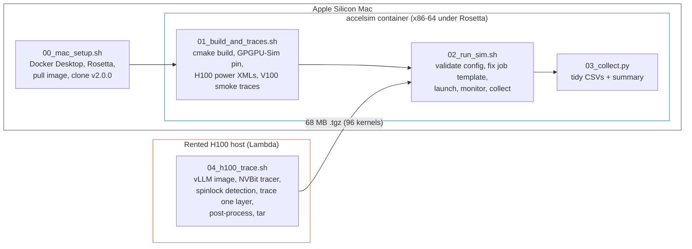
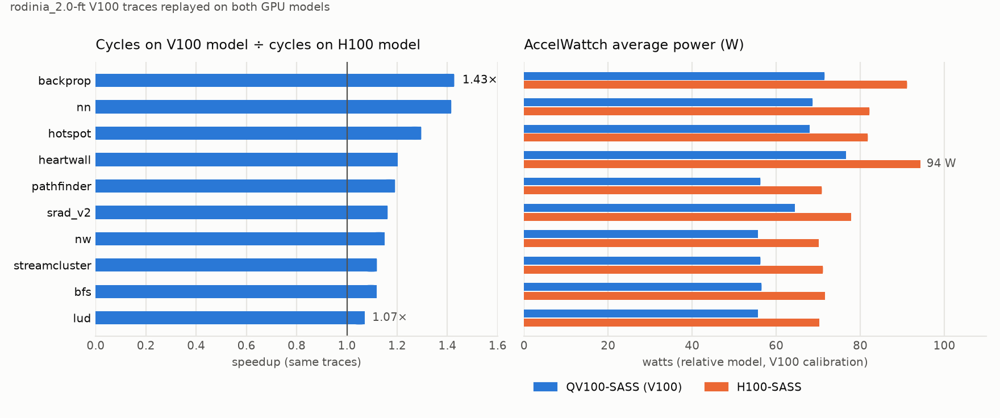
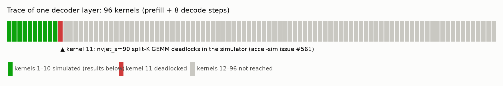
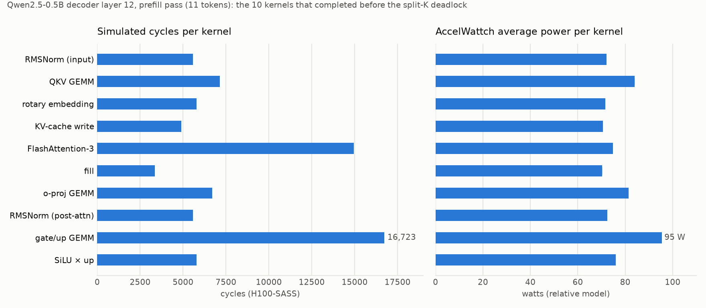

<h1 align="center">LLM performance &amp; power on a simulated H100</h1>

<p align="center">
Cycle-level simulation of real Hopper LLM kernels with <a href="https://github.com/accel-sim/accel-sim-framework">Accel-Sim 2.0</a> and the AccelWattch power model,<br>
run end to end on an Apple Silicon Mac, with a 40-minute H100 rental for tracing.
</p>

<p align="center">


<a href="LICENSE"></a>
</p>

---

## TL;DR

- **A reproducible pipeline** (five scripts) that builds Accel-Sim 2.0 in a container on a Mac, replays published traces, traces one transformer layer of a real LLM on a rented H100, and replays it on the H100 model with power. Every upstream problem hit along the way is worked around in the scripts and documented below.
- **Validated on published Tesla V100 traces**: 10 benchmarks, all clean, cycle counts identical with and without the power model; the H100 model replays the same traces in **1.07× to 1.43×** fewer cycles.
- **A real H100 trace of a decoder layer** of Qwen2.5-0.5B under vLLM: 96 kernels, prefill plus 8 decode steps. The full prefill pass (10 kernels: RMSNorm, QKV GEMM, rotary, KV-cache write, FlashAttention-3, o-proj GEMM, gate/up GEMM, SiLU) simulates cleanly: **76,502 cycles, 32.6 M instructions, 79.6 W** average.
- **A simulator bug found and filed**: the 11th kernel, a cuBLAS **split-K GEMM** (`nvjet_sm90_*_splitK`, the kernel cuBLAS picks for small-M decode GEMMs), deadlocks in the simulator's `mbarrier` model. See [accel-sim/accel-sim-framework#561](https://github.com/accel-sim/accel-sim-framework/issues/561) and [the section below](#the-split-k-deadlock-accel-sim-issue-561).

> [!NOTE]
> All watts in this repository come from AccelWattch's **V100-calibrated** coefficients (the only ones upstream ships; SM count and clock are injected at runtime). They are a **relative** power model, good for kernel-vs-kernel and config-vs-config comparison, not absolute H100 watts. Details in [Power model caveat](#power-model-caveat).

---

## Contents

- [Background](#background)
- [Pipeline](#pipeline)
- [Repository layout](#repository-layout)
- [Reproduce it](#reproduce-it)
- [Results](#results)
  - [1. Toolchain validation on published V100 traces](#1-toolchain-validation-on-published-v100-traces)
  - [2. H100 model vs V100 model on the same traces](#2-h100-model-vs-v100-model-on-the-same-traces)
  - [3. A real LLM layer on the H100 model](#3-a-real-llm-layer-on-the-h100-model)
- [The split-K deadlock (Accel-Sim issue #561)](#the-split-k-deadlock-accel-sim-issue-561)
- [Power model caveat](#power-model-caveat)
- [Upstream problems the scripts work around](#upstream-problems-the-scripts-work-around)
- [Time and cost](#time-and-cost)
- [Next steps](#next-steps)
- [References](#references)

---

## Background

**Why simulate at all?** Measuring an LLM on real hardware tells you *what* it costs, not *why*. A cycle-level simulator exposes the microarchitecture: which kernels stall on memory, how the L2 behaves, what the tensor cores are doing per cycle, and how much of the power goes to each unit. That is what you need to reason about a design you cannot buy yet, or to attribute energy to parts of a model.

**Accel-Sim 2.0** ([accel-sim.github.io](https://accel-sim.github.io)) is the current state of the art in academic GPU simulation. It is *trace-driven*: an NVBit tool records the SASS instruction stream of real kernels on real hardware, and the simulator replays those traces on a detailed timing model of the GPU (GPGPU-Sim 4.x underneath). Version 2.0, released in August 2026, added a full **Hopper** model: TMA, asynchronous warp-group MMA, `mbarrier` producer/consumer synchronisation, thread-block clusters, HBM3, and a chiplet L2. It reports a 99% Pearson correlation and 13.4% mean cycle error against real H100 silicon over 34,000 kernels. **AccelWattch** is its power model (MICRO 2021), a McPAT-based model driven by the simulator's activity counters.

**Why one layer?** A transformer is a stack of identical decoder blocks. Accel-Sim 2.0 attaches NVBit to the live PyTorch process inside vLLM and switches tracing on only around the forward pass of one named module. One representative block, traced through prefill and a few decode steps, is enough to extrapolate the model, and it keeps the trace at tens of megabytes instead of terabytes.

**Why a Mac?** Because there is no GPU needed for anything except the ~10-minute tracing step. The x86-64 simulator image runs under Rosetta in Docker Desktop at 2 to 4× native speed, which is fine for the small kernels here. The one rental was 40 minutes of a 2× H100 node.

---

## Pipeline



Each script is idempotent and re-runnable. Bind mounts make everything persistent: `~/accelsim/accel-sim-framework` is `/accel-sim` in the container, `~/accelsim/traces` is `/traces`, `~/accelsim/results` is `/results`.

| Script | Runs on | What it does | Time |
|---|---|---|---|
| `00_mac_setup.sh` | Mac | Installs/starts Docker Desktop, checks Rosetta and memory, pulls the 12 GB image, clones Accel-Sim v2.0.0, creates or re-attaches the container | 20–30 min first time |
| `01_build_and_traces.sh` | container | Installs missing build deps, builds with cmake (LTO off), pins GPGPU-Sim, copies power XMLs into the H100 config, writes the `llm_layer` app suite, downloads the V100 smoke traces | 15–25 min first time |
| `02_run_sim.sh` | container | Validates benchmark and config names, applies the job-template revert, sizes concurrency from the memory limit, launches, monitors, collects stats and power reports | minutes to hours |
| `03_collect.py` | anywhere | Parses the stats tool's CSV blocks and the AccelWattch reports into `perf_tidy.csv`, `power_tidy.csv`, `summary.csv` | seconds |
| `04_h100_trace.sh` | GPU host | Pulls the upstream vLLM image, builds the NVBit tracer, runs spinlock detection, traces one named layer, post-processes to `.tracez`, tars it | ~20 min incl. pull |

---

## Repository layout

```
.
├── 00_mac_setup.sh … 04_h100_trace.sh   the pipeline
├── 03_collect.py
├── results/
│   ├── smoke/                 rodinia_2.0-ft V100 traces on QV100-SASS
│   ├── smoke-power/           same, with AccelWattch
│   ├── h100-power/            same traces on H100-SASS with AccelWattch
│   └── qwen25-0.5b__layer12/  the LLM layer on H100-SASS with AccelWattch (partial, see #561)
│       ├── summary.csv, perf_tidy.csv, power_tidy.csv
│       ├── accelwattch_power_report.log       per-kernel power report
│       ├── simulator_stdout_with_deadlock.txt.gz
│       ├── trace_info.txt                      model, layer, prompt, GPU, driver, versions
│       └── kernelslist.g                       the 96 kernel trace files, in order
└── docs/
    ├── img/                                    charts (light + dark)
    └── upstream-issue-561-splitK-deadlock.md   the bug report as filed
```

The 68 MB trace itself is published as a GitHub release asset rather than committed; see [Releases](../../releases).

---

## Reproduce it

<details>
<summary><b>On the Mac</b> (Apple Silicon, Homebrew, ≥ 8 GB for Docker)</summary>

```bash
chmod +x *.sh
./00_mac_setup.sh                 # asks once before installing Docker Desktop; drops you into the container
```
</details>

<details>
<summary><b>In the container</b></summary>

```bash
./01_build_and_traces.sh
./02_run_sim.sh rodinia_2.0-ft /traces/rodinia_2.0-ft/9.1 QV100-SASS smoke
./02_run_sim.sh rodinia_2.0-ft /traces/rodinia_2.0-ft/9.1 QV100-SASS-Accelwattch_SASS_SIM smoke-power
./02_run_sim.sh rodinia_2.0-ft /traces/rodinia_2.0-ft/9.1 H100-SASS-Accelwattch_SASS_SIM h100-power
python3 03_collect.py /results/h100-power
```
</details>

<details>
<summary><b>On a rented H100</b> (any provider with Docker and the NVIDIA container toolkit; Lambda Cloud was used)</summary>

```bash
scp 04_h100_trace.sh ubuntu@<ip>:~/ && ssh ubuntu@<ip>
sudo usermod -aG docker ubuntu && exit && ssh ubuntu@<ip>      # docker group needs a fresh login
./04_h100_trace.sh -L                                           # pulls image, builds tracer, lists module names
./04_h100_trace.sh -m Qwen/Qwen2.5-0.5B -l model.layers.12 -n 8 -N qwen25-0.5b__layer12
# copy ~/accelsim-h100/traces/qwen25-0.5b__layer12.tgz to the Mac's ~/accelsim/traces/ and untar it, then in the container:
./02_run_sim.sh llm_layer /traces/qwen25-0.5b__layer12 H100-SASS-Accelwattch_SASS_SIM qwen25-0.5b__layer12
```
Container-style providers (RunPod, Vast.ai) have no Docker inside the pod: start the pod from `ghcr.io/accel-sim/accel-sim-framework:ubuntu-24.04-cuda-12.8-vllm` and run the script's inner half with `ACCELSIM_ROOT=… TRACES_ROOT=… bash 04_h100_trace.sh --inside …` (documented in the script header).
</details>

Config names compose a base with dash-joined modifiers from `util/job_launching/configs/define-standard-cfgs.yml`: `H100`, `H200`, `QV100`, `GV100`, `A100`, … plus `SASS`, `PTX`, `Accelwattch_SASS_SIM`, `Accelwattch_SASS_HW`, `Accelwattch_SASS_HYBRID`. `02_run_sim.sh` validates the name before launching, because the upstream launcher just crashes on a typo.

---

## Results

### 1. Toolchain validation on published V100 traces

There are no published H100 or LLM traces anywhere (the public catalogue behind `get-accel-sim-traces.py` holds only Tesla V100 sets from 2020), so the smoke test replays the small `rodinia_2.0-ft` set, 11 apps, 21 MB, on the V100 model. All 10 launched jobs finished with no errors, and the cycle and instruction counts are **identical with and without the power model**, which is the first thing to check when enabling AccelWattch.

| app | cycles | instructions | IPC | avg W | peak W |
|---|---:|---:|---:|---:|---:|
| backprop | 14,731 | 10,473,824 | 711.0 | 71.5 | 145.1 |
| bfs | 115,556 | 1,210,998 | 10.5 | 56.5 | 67.0 |
| heartwall | 8,389 | 7,329,465 | 873.7 | 76.6 | 128.4 |
| hotspot | 53,853 | 33,950,092 | 630.4 | 67.9 | 111.0 |
| lud | 127,309 | 418,884 | 3.3 | 55.6 | 60.6 |
| nn | 29,962 | 6,714,538 | 224.1 | 68.7 | 141.5 |
| nw | 132,656 | 595,236 | 4.5 | 55.6 | 56.7 |
| pathfinder | 28,717 | 1,059,640 | 36.9 | 56.2 | 58.6 |
| srad_v2 | 29,211 | 10,888,254 | 372.7 | 64.4 | 109.0 |
| streamcluster | 1,172,585 | 20,365,977 | 17.4 | 56.3 | 59.5 |

<sup>Config `QV100-SASS-Accelwattch_SASS_SIM`. Full data: [`results/smoke-power/`](results/smoke-power/).</sup>

The power numbers behave as V100 power should: a static floor around 55 W for latency-bound kernels (bfs, lud, nw), and compute-heavy kernels (backprop, nn, heartwall) peaking above 125 W.

### 2. H100 model vs V100 model on the same traces

The V100 traces replay on the H100 model too; traces are instruction-level and the H100 config (132 SMs, 1980 MHz, 50 MB L2, HBM3) just runs them faster. This is a check that the Hopper model works, not a claim about real H100 performance on Volta-era code.

<picture>
  <source media="(prefers-color-scheme: dark)" srcset="docs/img/v100-vs-h100-dark.png">
  
</picture>

| app | V100 cycles | H100 cycles | speedup | V100 avg W | H100 avg W |
|---|---:|---:|---:|---:|---:|
| backprop | 14,731 | 10,321 | 1.43× | 71.5 | 91.1 |
| nn | 29,962 | 21,168 | 1.42× | 68.7 | 82.2 |
| hotspot | 53,853 | 41,554 | 1.30× | 67.9 | 81.8 |
| heartwall | 8,389 | 6,978 | 1.20× | 76.6 | 94.3 |
| pathfinder | 28,717 | 24,098 | 1.19× | 56.2 | 70.9 |
| srad_v2 | 29,211 | 25,135 | 1.16× | 64.4 | 77.8 |
| nw | 132,656 | 115,329 | 1.15× | 55.6 | 70.1 |
| bfs | 115,556 | 103,386 | 1.12× | 56.5 | 71.5 |
| streamcluster | 1,172,585 | 1,047,541 | 1.12× | 56.3 | 71.1 |
| lud | 127,309 | 118,888 | 1.07× | 55.6 | 70.2 |

<sup>Full data: [`results/h100-power/`](results/h100-power/).</sup>

**How to read the power columns.** The uniform rise of roughly 15 W on the H100 model is the V100 idle-core coefficient multiplied across 132 SMs instead of 80. It is not a measurement of Hopper's static power. Kernel-vs-kernel and config-vs-config comparisons are meaningful; absolute watts are not.

### 3. A real LLM layer on the H100 model

**What was traced.** `Qwen/Qwen2.5-0.5B` served by vLLM 0.27.1 (`enforce_eager=True`, single process) on an H100 80 GB SXM5 (driver 580.105.08), with Accel-Sim's PyTorch hook switching NVBit tracing on only inside `model.layers.12`, a complete decoder block. One prompt of 11 tokens, 8 generated tokens, so the trace contains the block's prefill pass and 8 decode passes: **96 kernels**, 68 MB compressed. Spinlock detection ran first (two passes, 491 spin-loop sites found), then the traced run with `SPINLOCK_HANDLING_MODE=2`, then post-processing to `.tracez`. The model's output for the prompt was normal (`" the dog is lazy.  Given the"`), so the hooked process was generating correctly. Metadata: [`results/qwen25-0.5b__layer12/trace_info.txt`](results/qwen25-0.5b__layer12/trace_info.txt).

**What happened on replay.** The simulator ran the first 10 kernels, the entire prefill pass, and then deadlocked on kernel 11.

<picture>
  <source media="(prefers-color-scheme: dark)" srcset="docs/img/llm-layer-kernel-strip-dark.png">
  
</picture>

**Prefill pass, per kernel** (`H100-SASS-Accelwattch_SASS_SIM`):

<picture>
  <source media="(prefers-color-scheme: dark)" srcset="docs/img/llm-layer-kernels-dark.png">
  
</picture>

| # | kernel (vLLM / cuBLAS / CUTLASS) | role in the block | cycles | instructions | avg W |
|--:|---|---|---:|---:|---:|
| 1 | `vllm::fused_add_rms_norm_kernel` | input RMSNorm | 5,581 | 623,310 | 72.1 |
| 2 | `nvjet_sm90_tst_64x8_64x16_4x2_h_bz_bias_TNT` | QKV projection GEMM | 7,148 | 5,641,136 | 84.0 |
| 3 | `vllm::rotary_embedding_kernel` | RoPE | 5,786 | 572,440 | 71.6 |
| 4 | `vllm::reshape_and_cache_flash_kernel` | KV-cache write | 4,910 | 157,056 | 70.6 |
| 5 | `cutlass::device_kernel<flash::…sm90…>` | FlashAttention-3 | 14,954 | 6,140,544 | 74.8 |
| 6 | `at::native::vectorized_elementwise_kernel<FillFunctor>` | fill | 3,346 | 2,950 | 70.3 |
| 7 | `nvjet_sm90_tst_64x8_64x16_4x2_h_bz_TNT` | output projection GEMM | 6,707 | 4,410,171 | 81.4 |
| 8 | `vllm::fused_add_rms_norm_kernel` | post-attention RMSNorm | 5,569 | 623,310 | 72.4 |
| 9 | `nvjet_sm90_tst_128x16_64x11_4x1_v_bz_TNT` | gate/up projection GEMM | 16,723 | 12,875,921 | 95.4 |
| 10 | `vllm::act_and_mul_kernel<SiluAndMul>` | SiLU × up | 5,778 | 1,592,960 | 76.0 |
| 11 | `nvjet_sm90_tst_64x8_64x16_4x2_h_bz_splitK_TNT` | down projection GEMM (split-K) | **deadlock** | | |
| | **prefill total (1–10)** | | **76,502** | **32,639,798** | **79.6** |

<sup>Cycles are per kernel instance from `per_kernel_instance_stats`; watts from the per-kernel AccelWattch report. Full data: [`results/qwen25-0.5b__layer12/`](results/qwen25-0.5b__layer12/).</sup>

Two things stand out even in this partial result. The two MLP GEMMs and FlashAttention-3 account for about 60% of the block's prefill cycles, with the gate/up GEMM alone at 22%. And the GEMMs are the power peaks (84 to 95 W) while everything else sits within 10 W of the floor, which is the expected shape for a tensor-core-bound block and a sanity check on the activity-factor model.

---

## The split-K deadlock (Accel-Sim issue #561)

> [!IMPORTANT]
> **Kernel 11 of the trace, `nvjet_sm90_tst_64x8_64x16_4x2_h_bz_splitK_TNT`, hangs the simulator.** It is the cuBLAS split-K GEMM that vLLM's down-projection selects for small-M shapes, so it recurs once per decode step and will affect anyone replaying an LLM trace on the Hopper model. The report, with the evidence below and the failing kernel's trace offered for reproduction, is filed as **[accel-sim/accel-sim-framework#561](https://github.com/accel-sim/accel-sim-framework/issues/561)**. Follow that thread for the upstream response; this section records what was established locally.

**Symptom.** After ~100k cycles GPGPU-Sim reports `ERROR ** deadlock detected: last writeback core 84 @ gpu_sim_cycle 10432 … (89568 cycles ago)` with every core listed as no longer committing. Just before it, once per SM, the trace-driven frontend prints `WARNING: sid N warp 8 pc 0x3410 EXIT in replay region - overriding mask …`. The full stdout is in [`results/qwen25-0.5b__layer12/simulator_stdout_with_deadlock.txt.gz`](results/qwen25-0.5b__layer12/simulator_stdout_with_deadlock.txt.gz).

**What the kernel looks like.** Grid 8×12, 384 threads per CTA, 168 registers, 164 KB shared memory, a warp-specialised Hopper GEMM. Decoding its trace with `traceDsm` shows 3,921 `REPLAY_START` markers but only 2,769 `REPLAY_END`; the difference, 1,152, is exactly the warp count (96 CTAs × 12 warps): every warp's final spin region runs into its `EXIT`. The regions are `mbarrier` waits:

```
REPLAY_START
SYNCS.PHASECHK.TRANS64.TRYWAIT R0 R4 …
NANOSLEEP.SYNCS 50000
SYNCS.PHASECHK.TRANS64 R0 R4 …
BRA …
REPLAY_END
```

**Experiments that narrow it down.**

| experiment | result | conclusion |
|---|---|---|
| Same kernel alone, `-gpgpu_deadlock_detect 0` | spins at 100% CPU for the full 25-minute cap, no progress | a genuine hang, not a false detection |
| Same kernel with every replay marker stripped (per-warp `insts =` counts recomputed), replayed as plain `.traceg` | identical deadlock at the same cycle (`last writeback core 21 @ gpu_sim_cycle 10492`) | the replay-region logic is not the cause; warps stall on the `TRYWAIT` itself |
| The replay-loop abort path (`handle_replay_region_exit`, 100 iterations) | its message never appears | warps are not looping in the region |

So the `mbarrier` phase the consumer warps wait on never completes in the simulator's model for this kernel, plausibly because the producer warps leave through the overridden-mask `EXIT` path first. That is inside the simulator's Hopper synchronisation model and not something the trace or the scripts can route around.

**Everything else in the layer simulates.** FlashAttention-3 with its own `mbarrier` pipelines, the non-split-K `nvjet_sm90` GEMMs, and all the vLLM kernels run to completion, which is why the prefill pass above is complete.

**If you hit this too.** Options, roughly in order of effort: (1) follow #561 and pin `GPGPUSIM_BRANCH` in `01_build_and_traces.sh` to the fixing commit when it lands; (2) simulate the other kernels with the launcher's `--per-kernel` mode and exclude the split-K instances; (3) change the GEMM shape so cuBLAS does not choose split-K, for example a larger batch, and re-trace.

---

## Power model caveat

AccelWattch needs `accelwattch_*.xml` next to the base `gpgpusim.config`. Upstream ships them for five GPUs (TITANX, RTX 2060 S, GV100, QV100, TITANV), and **all five files are byte-identical**: the published V100 calibration. At runtime the simulator overrides `number_of_cores`, `target_core_clockrate` and the core `clock_rate` from the config, so SM count and clock are correct for each target; everything else (dynamic activity factors, `constant_power`, `idle_core_power`, the `static_cat*` lane-activation powers, McPAT structure sizes, tech node) is V100's.

`01_build_and_traces.sh` follows that precedent and copies the same six files into `SM90_H100`, with a README beside them. Consequences:

- comparisons between kernels, between configs and between runs are valid;
- absolute H100 watts are not (an H100 SXM's TDP is 700 W; the model's static floor is V100's);
- absolute calibration needs measured H100 power through AccelWattch's QP solver (`util/accelwattch/`), i.e. real hardware plus a profiling run.

The per-kernel AccelWattch report labels its component fields with a trailing comma (`gpu_avg_IBP, = 0.26`); `03_collect.py` handles it and keeps all 284 fields per kernel in `power_tidy.csv`.

---

## Upstream problems the scripts work around

Everything below was verified against the v2.0.0 tag and the `ubuntu-24.04-cuda-12.8` image on 16–17 September 2026.

| problem | where | workaround |
|---|---|---|
| The image's NVIDIA devtools apt source is unsigned; `apt-get update` exits 100 | image | `--allow-insecure-repositories` (as the Dockerfile itself does) |
| Image lacks `libzstd-dev` (trace parser), `python3-dev` (pybind11), `bc` (tracer Makefile) | image | installed on demand |
| `setup_environment.sh` reads unset variables and clones GPGPU-Sim's moving `dev` branch | build | sourced with `set +u`; `GPGPUSIM_BRANCH` pinned to the commit that shipped with v2.0.0 |
| pybind11 turns on LTO for the Python module and GCC 13's `lto1` crashes under Rosetta | build | `-DCMAKE_INTERPROCEDURAL_OPTIMIZATION=OFF` |
| v2.0.0's `slurm.sim` job template stages runs in `/tmp` and depends on `squeue` + rsync; under the local process manager it deletes its temp dir immediately and loses stdout (upstream reverted it the next day, #556) | launcher | `02_run_sim.sh` applies the same revert when no Slurm/Torque is present |
| The local process manager launches one job per CPU regardless of memory; each trace-driven job needs ~4 GB | launcher | job limit derived from the container's cgroup memory limit |
| `get-accel-sim-traces.py` with no `-a` downloads the whole catalogue (~160 GB) | traces | never called without a selection |
| Stats CSV headers are regexes with trailing commas | collection | parser written from the printer's source |
| `docker run -it` fails without a TTY; the tracer script must self-copy with an absolute path; the `ubuntu` user needs the `docker` group | rental | all handled in `04_h100_trace.sh` |

---

## Time and cost

| step | wall time | cost |
|---|---|---|
| Docker Desktop + 12 GB image + clone | ~30 min | 0 |
| Simulator build under Rosetta | ~20 min | 0 |
| V100 smoke run (10 apps), each of three configs | ~10 min each | 0 |
| H100 rental: image pull, tracer build, spinlock passes, trace, package | ~40 min | ≈ $6 (2× H100 SXM5 at $8.38/h; single H100s were sold out) |
| LLM-layer replay to the deadlock | ~3 min | 0 |

---

## Next steps

- Track [#561](https://github.com/accel-sim/accel-sim-framework/issues/561); re-run the existing trace when the `mbarrier` model is fixed. No new rental needed.
- Per-kernel simulation of the remaining 85 kernels to get decode-phase numbers now, with the split-K instances excluded and documented.
- Re-trace at larger batch sizes (different cuBLAS kernel selection) and for prefill vs decode separately, which is the actual study this pipeline was built for: energy per token, attention vs MLP share, H100 vs H200 configs.
- Calibrate AccelWattch for Hopper with measured power, if a profiling run on real hardware becomes available.

---

## References

- Khairy, Shen, Aamodt, Rogers. *Accel-Sim: An Extensible Simulation Framework for Validated GPU Modeling.* ISCA 2020.
- Kandiah, Peverelle, Khairy, Pan, Saeed, Rogers, Aamodt, Hardavellas. *AccelWattch: A Power Modeling Framework for Modern GPUs.* MICRO 2021.
- Accel-Sim 2.0 release and Hopper model: [github.com/accel-sim/accel-sim-framework](https://github.com/accel-sim/accel-sim-framework) (v2.0.0, August 2026), documentation at [accel-sim.github.io](https://accel-sim.github.io).
- NVBit: [github.com/NVlabs/NVBit](https://github.com/NVlabs/NVBit) (v1.8).
- vLLM: [github.com/vllm-project/vllm](https://github.com/vllm-project/vllm) (0.27.1).

Traces were collected on Lambda Cloud. The V100 smoke traces are the public `rodinia_2.0-ft` set published by the Accel-Sim authors.

---

<p align="center"><sub>MIT licensed. Scripts, results and charts in this repository were produced in September 2026.</sub></p>
